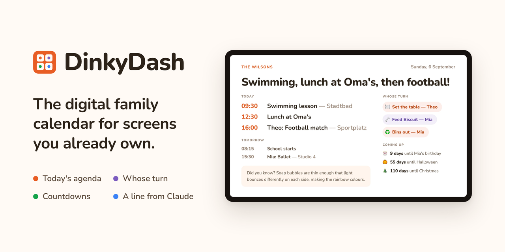
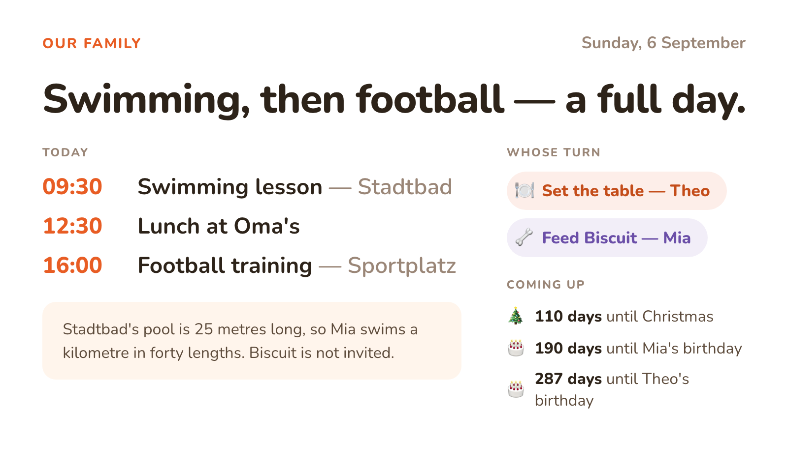

# DinkyDash

The digital family calendar for screens you already own — a TV, an old tablet, or a Raspberry Pi.



Website: [dinkydash.co](https://dinkydash.co)

Every morning, DinkyDash merges your calendars into one agenda, works out whose turn each chore is, counts down to the next birthday, and asks Claude for a headline and one line of copy. Then it puts the lot on a screen at home — light or dark, sized to read from across the kitchen.

## Two ways to run it

**Self-hosted (this repo).** Free, MIT-licensed, runs on your own hardware with your own Anthropic API key. Setup takes an afternoon and some comfort with a terminal.

> Self-hosting is **community-supported**. Issues and pull requests are welcome, but there is no support commitment — if you need it to just work, use the hosted version.

**Hosted.** [Start a free 14-day trial.](https://app.dinkydash.co/login) No card required. Paid subscriptions are still in development; planned pricing is $39/year or $6/month. Built from this same repo — see [PLAN.md](PLAN.md).

## What the dashboard shows

- Today's agenda, in time order, merged from as many Google, Apple iCloud and Outlook
  calendars as you like — anything with an iCal link, pasted in, no account sign-in
- A personal calendar can show only the events shared with your partner, and keep
  work and private appointments to itself
- A look at tomorrow underneath it, on the days today leaves room
- Whose turn each chore is — rotated daily, nothing to tick off
- Countdowns to birthdays, holidays and special dates
- An AI-written headline, and one line that is some days a fact, some days
  about the dog
- Light or dark, chosen in the settings UI

Configure all of it from your phone at `/settings`, or by editing `config.yaml` directly — they are
the same file, and the UI keeps your comments.

## How it works

```
[cron every 5m] → generate.py --tick → every hour: re-fetches every iCal feed, in time order
                                     → once a day at 06:00 (and at once on the first run):
                                       builds the prompt, calls Claude
                                     → saves dashboard_data.json

[browser]       → web/routes/board.py → recomputes chores, countdowns and today's agenda
                                      → renders the dashboard
```

Only the headline and the written line come from the model. Ages, countdowns, chore turns and the
agenda are recomputed on every render, so if a morning's run fails the times and turns on the wall
are still today's — the dashboard just labels the written line as older.

---

## Quickstart

You can see the real dashboard in about two minutes, with no API key and nothing to pay for.

```bash
git clone https://github.com/caspii/dinkydash.git
cd dinkydash
python3 -m venv venv && source venv/bin/activate
pip install -r requirements.txt
cp config.example.yaml config.yaml    # edit by hand, or from /settings once it runs
python sample_board.py                # a dashboard for today; calls no API, costs nothing
python app.py
```

- http://localhost:5000 — the dashboard
- http://localhost:5000/settings — configure it from a phone
- http://localhost:5000/preview — Pi, TV and tablet sizes side by side

The chore turns, ages and countdowns are computed from the `config.yaml` you just made, so
editing it and reloading shows your own family. Only the headline and the one written line
are canned until you add an Anthropic API key.

**Then follow the [getting started guide](https://dinkydash.co/getting-started/)** — it has
the API key step, where to find your calendar's iCal link for Google, iCloud and Outlook, and
the whole Raspberry Pi build with systemd, kiosk mode and the screen schedule.

> **There is no login.** The dashboard and the settings UI are both served without authentication, so
> anyone who can reach the port can read your family's agenda and rewrite `config.yaml` — names,
> birthdays, and every calendar link in it.
>
> That is deliberate rather than unfinished: DinkyDash is a config file with a web form on it, and
> the file has no login either. It assumes it is on your home network, the same as a printer.
>
> **So keep the port off the public internet.** Do not forward port 5000 on your router. If you need
> it from outside the house, reach it over a VPN such as [Tailscale](https://tailscale.com) or
> [WireGuard](https://www.wireguard.com), or put a reverse proxy with basic auth in front of it.
>
> Hosted mode is a different matter — it authenticates every request and is scoped per family. See
> [PLAN.md](PLAN.md).

---

## Documentation

| What you want | Where it is |
|---|---|
| Install it, and put it on a Raspberry Pi | [dinkydash.co/getting-started](https://dinkydash.co/getting-started/) |
| Every config key, with comments | [`config.example.yaml`](config.example.yaml) |
| Living with it: the daily cycle, the two buttons, what to check when something looks wrong | [`doc/running-it.md`](doc/running-it.md) |
| Coming from an older version | [`doc/upgrading.md`](doc/upgrading.md) |
| The hosted build: architecture, phases, decisions | [`PLAN.md`](PLAN.md) |
| Working on the code | [`CLAUDE.md`](CLAUDE.md) |
| Product terms and UI wording | [`doc/terminology.md`](doc/terminology.md) |

The install and Pi guides live on the website rather than here, so there is one copy of each
to keep right.

## Local hosted development

Conductor's **dev** run action starts the hosted dashboard and marketing website
together. The same command outside Conductor is `venv/bin/python dev.py`.
See [local development](doc/development.md) for the required development database
and session key, ports, sign-in, and how Conductor picks up the run configuration.
The self-hosted quickstart above is unchanged.

## Running the tests

```bash
pip install -r requirements-dev.txt   # adds pytest and the website build; not needed on the Pi
python -m pytest tests/ -q
```

368 tests, well under a second. They cover leap years, timezone conversion, event ordering, chore
rotation, the stale-dashboard logic, the config round-trip, and the settings routes that write it.

GitHub Actions runs the same command on every push and pull request, on Python 3.11
(`.github/workflows/test.yml`), alongside a [gitleaks](https://github.com/gitleaks/gitleaks) scan of
the full history. Both dependency files are pinned with `==`, so a clean `pip install` gets the
versions CI passed on. A pull request that fails either check shows a red X.

## Key files

| Path | Purpose |
|------|---------|
| `dinkydash/` | The engine. Pure functions plus the model call — no clock, no file reads |
| `dinkydash/context.py` | Ages, birthdays, countdowns, chore rotation |
| `dinkydash/calendars.py` | iCal fetch, parse, recurrence, merging feeds |
| `dinkydash/board.py` | Turns config + payload into what the dashboard renders |
| `dinkydash/runner.py` | The two halves of the cycle: `refresh_calendars` and `write_brief` |
| `dinkydash/schedule.py` | `due()` — which of the two the clock and the config owe right now |
| `dinkydash/store.py` | Where the config, the dashboard and the note history are kept |
| `migrations/` | The hosted schema, plain SQL. Self-hosting needs none of it |
| `web/` | Flask app — dashboard, settings UI, templates |
| `web/templates/board.html` | The dashboard itself, light and dark, all screen sizes |
| `generate.py` | Command-line skin over `dinkydash.runner` — this is what cron calls |
| `app.py` | Flask entry point |
| `config.yaml` | All configuration. The settings UI writes this same file |
| `config.example.yaml` | Template config, documenting every key |
| `tests/` | 368 tests. Run them before committing |
| `doc/` | Running it day to day, and upgrading from an older version |
| `design/` | Mockups for the dashboard and settings UI, with the reasoning |
| `deploy_to_pi.sh` | Deployment (rsync + service restart) |
| `.env` | `ANTHROPIC_API_KEY` (not in git) |
| `.env.example` | The template for it — copy to `.env` |
| `.github/workflows/test.yml` | CI: pytest and gitleaks, on every push and pull request |
| `.gitleaks.toml` | Secret-scanning rules, including one for iCal secret addresses |
| `dashboard_data.json` | The generated payload (not in git) |
| `content_history.json` | Recent notes, so the model doesn't repeat itself (not in git) |
| `PLAN.md` | Hosted MVP architecture and build phases |

## Contributing

Pull requests are welcome. The codebase is one monorepo serving both the self-hosted and the hosted build, so a change has to work in both modes — check [PLAN.md](PLAN.md) before starting anything structural, and open an issue first for larger changes.

Known rough edges are listed under "Known issues" in [CLAUDE.md](CLAUDE.md).

## License

MIT — see [LICENSE](LICENSE).
