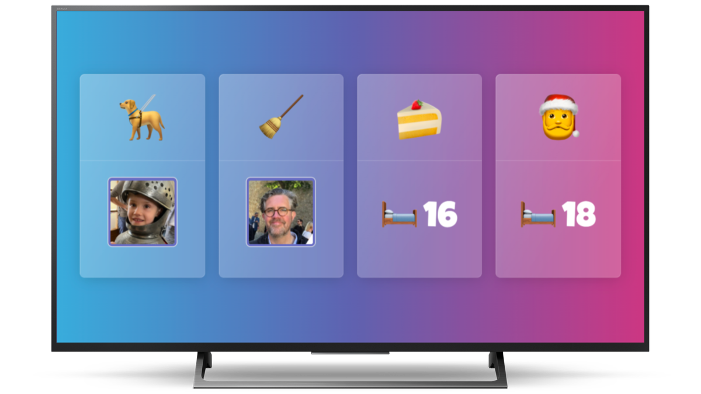

# DinkyDash



## Introduction

DinkyDash is a family dashboard that runs on a Raspberry Pi. Every day it calls the Claude API to generate fresh, personalized content based on your Google Calendar and family info.

The dashboard shows:
- AI-generated daily greeting and fun facts
- Personalized messages for each family member
- Recurring chore assignments (rotating daily)
- Countdowns to birthdays and special dates
- Upcoming calendar events with commentary
- A daily challenge and pet corner

## How It Works

A generation script (`generate.py`) runs once per day via cron. It:

1. Fetches your Google Calendar (iCal format)
2. Filters events to only those involving specified family members
3. Computes chore rotations, birthday countdowns, and special dates
4. Sends all this context to the Claude API
5. Saves the structured JSON response to `dashboard_data.json`

The Flask app (`app.py`) simply reads and renders that JSON. If the API is down, yesterday's dashboard persists.

## Setup

### Prerequisites

- Python 3.11+
- An [Anthropic API key](https://console.anthropic.com/settings/keys)
- A public Google Calendar iCal URL (Settings > Integrate calendar > Public address in iCal format)

### Local Development

```bash
python3 -m venv venv
source venv/bin/activate
pip install -r requirements.txt
```

Create your config file from the template:

```bash
cp config.example.yaml config.yaml
```

Edit `config.yaml` with your family details, calendar URL, and other settings.

Add family photos to `static/` (matching the filenames in your config).

Create a `.env` file with your API key:

```
ANTHROPIC_API_KEY=sk-ant-...
```

Generate the dashboard:

```bash
python generate.py
```

Run the dev server:

```bash
flask run --host=0.0.0.0
```

### Configuration

Edit `config.yaml` to customize:

- `calendar_url` - Your Google Calendar iCal URL
- `calendar_filter_emails` - Only show events where these people are attendees
- `people` - Family members (name, date of birth, sex, image, email, interests)
- `pets` - Family pets
- `recurring` - Daily rotating chores
- `special_dates` - Non-birthday countdowns (holidays, trips, etc.)
- `claude_model` - Which Claude model to use
- `max_tokens` - Max response length

### Raspberry Pi Deployment

```bash
./deploy_to_pi.sh
```

This rsyncs files to the Pi, restarts the Flask service, and installs dependencies. The `.env` file with your API key is included in the deploy.

After deploying, set up the daily cron job on the Pi:

```bash
ssh pi@raspberrypi
crontab -e
# Add this line:
0 6 * * * cd /home/pi/dinkydash && source venv/bin/activate && python generate.py >> generate.log 2>&1
```

### Pi-Specific Setup

- Install emoji fonts: `sudo apt install fonts-noto-color-emoji`
- Hide mouse cursor: `sudo apt-get install unclutter -y`
- Rotate display 180: add `lcd_rotate=2` to `/boot/config.txt`

## Key Files

| File | Purpose |
|------|---------|
| `generate.py` | Daily generation script (calendar fetch, Claude API call, JSON output) |
| `app.py` | Flask app that reads `dashboard_data.json` and renders the template |
| `config.yaml` | All dashboard configuration (people, calendar, chores, dates) |
| `templates/index.html` | Dashboard template (Bootstrap 5, optimized for 800x480) |
| `deploy_to_pi.sh` | Deployment script (rsync + service restart) |
| `.env` | API key (not committed to git) |
| `dashboard_data.json` | Generated daily content (not committed to git) |
